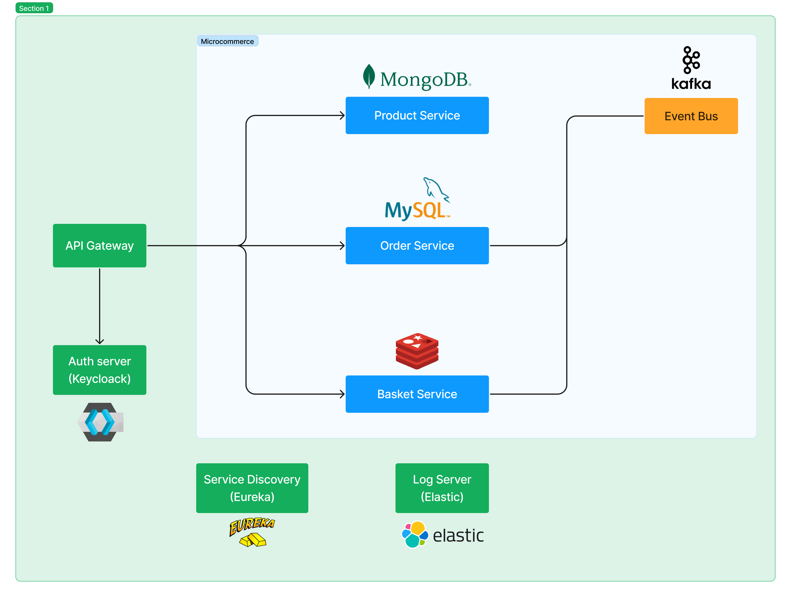

# Microcommerce

Microcommerce is E-Commerce application built with microservices using Java 17 and Spring 3. All necesseray endusrty standard features like Message Queue, Async communication, OAuth2, Elastick stack are implemented in this project.


## Run

It is simple. Just run docker on your machine and with help of docker compose:

```bash

docker-compose up -d

```

This command runs all services in a docker enviroment. Docker images are created with `mvn clean compile jib:dockerBuild` command. Just run this command in `./services/*`

## What are the services?

### High level architecture




### 1. Gateway

Gateway service is built with `Spring Gateway` and provide load balancing with help of `Spring Netflix Eureka` service discovery application built in Discovery service. Url's and other options is provided in application.yml file. This service also provide Authentication with help of OAuth2 sevice `Keycloak`. Authorization is completed inside services. 


### 2. Discovery

Discovery service is built with `Spring Netflix Eureka` discovery server. All other services are registered in this service and api gateway resolve url addressses with help of this server.


### 3. Product

This service is responsible for product, brand and category managment. Product's inventory is also managed in this service. MongoDB is used as a database because for very big product catalog there is a need of scaling.


### 4. Basket

This service is responsible for managing user's basket with CUSTOMER role. users with MANAGER roles can't use this service because this users cannot place an order. Redis is used as a database and in basket collection user's username is used as a primary key and therefore one user only have one basket. Also order placement is handled in this service with basket informations. When user is place order via `/baskets/order-place` url related service handle this request and send message to Kafka Message Queue as a producer. Order service is consumer for this message and creates order with this message. 


### 5. Order

Order list and delete operations managed in this service. Order creation is made from basket. Read `4. Basket` for detailed information. MySql is used as a database.


### 6. Keycloak

Keycloak is used as a identity service and Authorization Code flow is used for JWT creation. You can find sample requests in `docs/postman.json` file. Just import this file in postman and make requests.


## Docker image

Docker images are built with google's plugin `jib`. For creation of docker images just use following comands.


```bash

mvn clean compile jib:build # push to docker hub
mvn clean compile jib:dockerBuild # push to local docker instance

```

